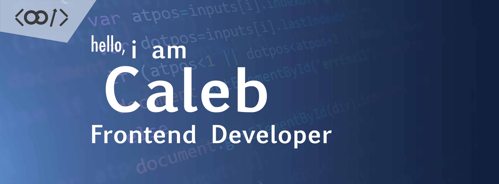

<div align="center" style="background: linear-gradient(135deg, #f5f7fa 0%, #c3cfe2 100%); padding: 20px; border-radius: 10px;">
  

  # Hello, I'm Caleb! 
  ### Frontend Developer & UI Designer

  <p>
    <a href="https://linkedin.com/in/calebdussey"></a>
    <a href="https://behance.net/calebdussey"></a>
    <a href="https://instagram.com/_.semekor.k"></a>
    <a href="https://discord.gg/semekork#3751"></a>
    <a href="https://codepen.io/semekork"></a>
  </p>
</div>

<div style="background-color: #f8f9fa; padding: 15px; border-radius: 8px; border-left: 4px solid #0366d6;">

## 🚀 About Me


- 🔭 Currently building awesome mobile experiences with React Native 
- 👀 Passionate about frontend development and cybersecurity 
- 💬 Ask me about UI design - I craft beautiful, intuitive interfaces! 
- 📱 Mobile dev enthusiast using React Native 
- 🤝 Looking to collaborate on exciting frontend/mobile projects 
- 📫 Reach me at: **Caleb.dussey04@gmail.com** 
- ⚡ Fun fact: I'm a big car enthusiast! 

</div>

<div style="background-color: #f0f5ff; padding: 15px; border-radius: 8px; border-left: 4px solid #2f80ed;">

## 💻 Tech Stack

<div align="center">
  <h3>Languages & Frameworks </h3>
  
  
  <h3>Design Tools </h3>
  
  
  <p><em>UI designer proficient in creating modern interfaces, design systems, and interactive prototypes</em></p>
  
  <h3>Developer Tools </h3>
  

</div>
</div>

<div style="background-color: #f5f0ff; padding: 15px; border-radius: 8px; border-left: 4px solid #7928ca;">

## ⏱️ Weekly Dev Stats

<!--START_SECTION:waka-->

```txt
From: 21 March 2025 - To: 28 March 2025

JavaScript   8 hrs 42 mins   ████████████████████████░   95.93 % 
JSON         12 mins         ▓░░░░░░░░░░░░░░░░░░░░░░░░   02.36 %
CSS          8 mins          ▒░░░░░░░░░░░░░░░░░░░░░░░░   01.65 %
```

<!--END_SECTION:waka-->


</div>

<div style="background-color: #fff7f0; padding: 15px; border-radius: 8px; border-left: 4px solid #f97316;">

## 📌 Current Focus

I'm currently focused on creating smooth, intuitive mobile experiences with React Native while elevating user interfaces through thoughtful design. My background in UI design helps me bridge the gap between aesthetics and functionality, creating experiences that are both beautiful and usable. If you're working on something that needs a designer's touch in the frontend space, let's connect!

<div align="center">
  
  
  
  <p><strong>Let's build something amazing together!</strong></p>
</div>

</div>

<div align="center" style="background: linear-gradient(135deg, #f5f7fa 0%, #c3cfe2 100%); padding: 15px; border-radius: 10px; margin-top: 20px;">
  <!-- README redesigned with ❤️ in 2025 -->
</div>
